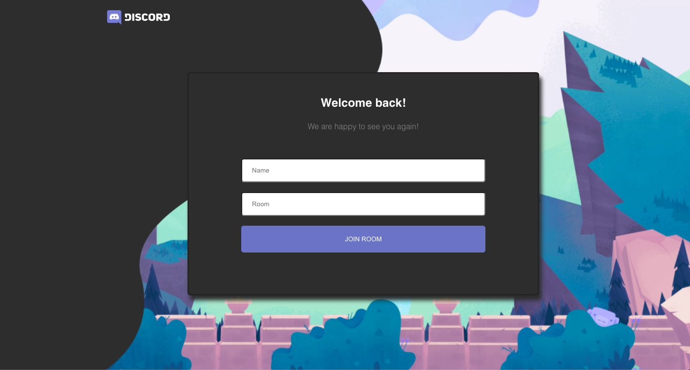

# Chat Application 💬 💬
original website hosted on --> https://5f7164570727d037de68263f--unruffled-bell-7e7c9b.netlify.app
# Motivation 
Making a chat application.

# Build status

# Code Style
- Server side code **standard**
- Client side code **PascalCase** 

# Screenshots

# Tech/framework used

- [Node](https://nodejs.org/en/)
- [Express](https://expressjs.com/)
- [Socket.io](https://socket.io/)
- [React](https://reactjs.org/)
- [React Router DOM](https://reactrouter.com/web/guides/quick-start)
- [Netlify](https://www.netlify.com/)
- [Heroku](https://www.heroku.com/)

# Features
- chat 
- emoji
- specific room

# Credits
Discord
# License
MIT © Dherendra Dev

